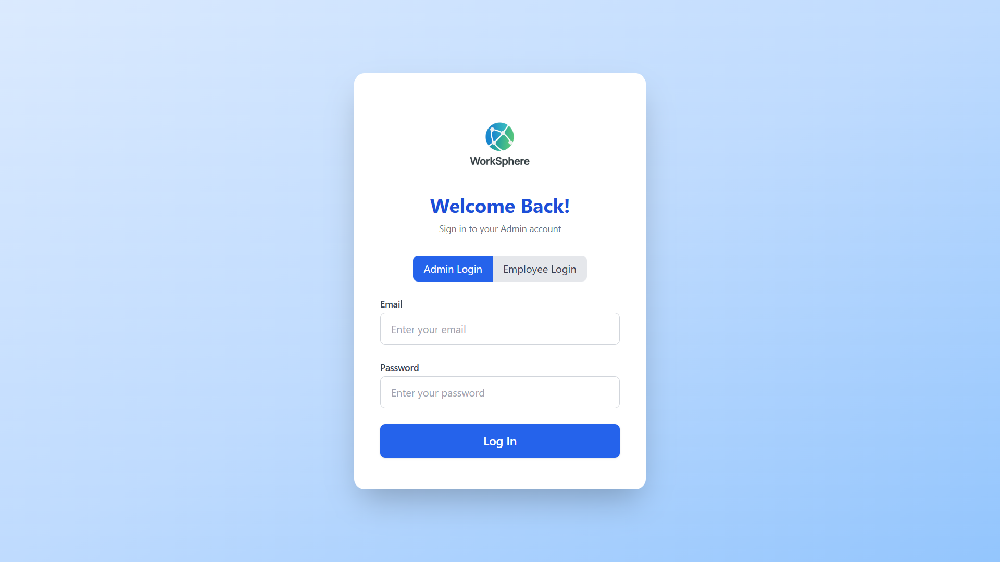
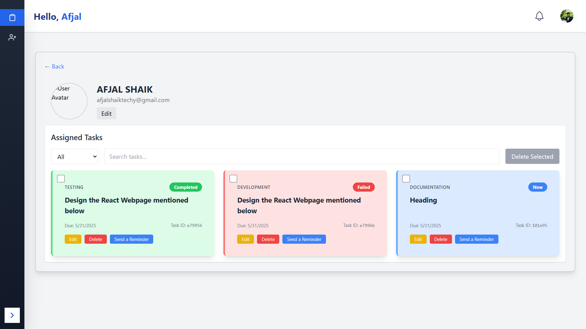
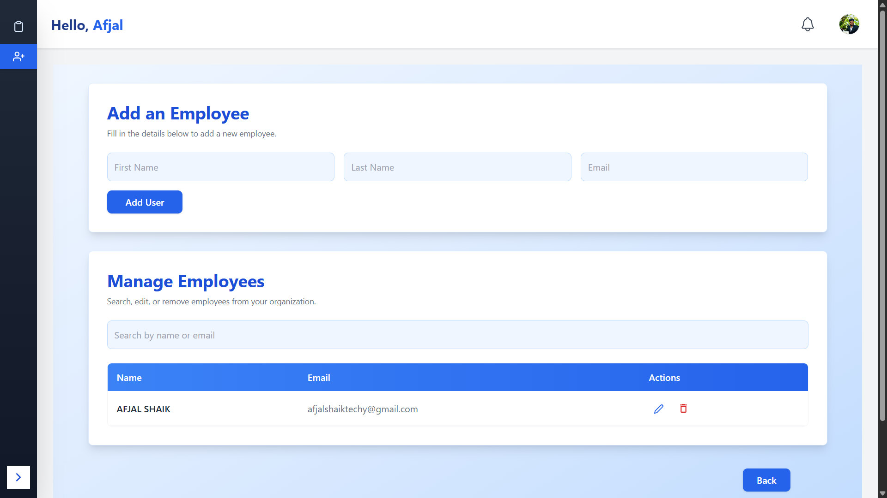
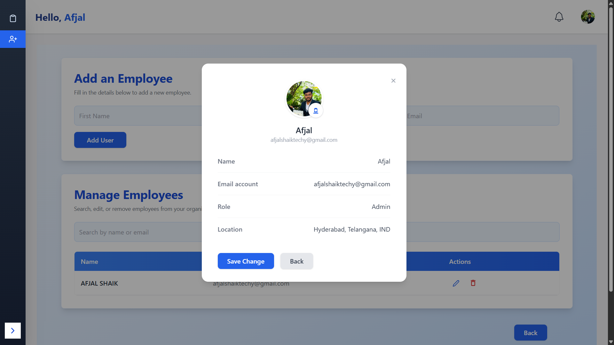

# 🧠 WorkSphere

WorkSphere is a smart task management and employee collaboration platform designed to simplify workflows, enhance productivity, and foster teamwork. It offers real-time updates, role-based permissions, and intuitive dashboards, it empowers admins and employees to stay in sync effortlessly.

---

## ✨ Features

### 👨‍💼 Admin Features
- 👥 **Manage Employees** – Add, update, or remove team members easily.
- 📋 **Assign Tasks** – Allocate tasks with deadlines, categories, and priorities.
- 🔔 **Instant Notifications** – Notify employees immediately about updates or new tasks.
- 📊 **Dashboard Analytics** – Get insights on team productivity and task stats.
- ⏰ **Task Reminders** – Automatic alerts for upcoming or overdue tasks.

### 👩‍💻 Employee Features
- 📌 **Task Dashboard** – View assigned tasks, due dates, and current status.
- 🔄 **Update Progress** – Change task status like *In Progress*, *Completed*, etc.
- 🔔 **Stay Informed** – Receive notifications about task updates and reminders.

### 🌐 General Features
- 🛡️ **Role-Based Access Control (RBAC)** – Secure login for admin and employee roles.
- 📱 **Responsive UI** – Works smoothly across mobile, tablet, and desktop.
- ⚡ **Real-Time Sync** – Powered by Socket.IO for instant updates.
- 🔍 **Search & Filter** – Easily locate tasks or employees.
- 🧾 **Profile Page** – Profile pages for both Admin and Employee Dashboards.

---

## 🛠️ Tech Stack

### 🎨 Frontend
- **React.js** – Modular UI development.
- **Tailwind CSS** – Clean and responsive styling.  
- **Axios** – For API communication.
- **React Quill** – Rich-text editor for creating detailed task descriptions.
- **Context API** – Manage global state across components.
- **React Router** – Routing between pages and dashboards.

### ⚙️ Backend
- **Node.js** – Server-side JavaScript  
- **Express.js** – Fast and lightweight API framework  
- **Socket.IO** – Real-time communication  

### 💾 Database
- **MongoDB** – Flexible NoSQL database  
- **Mongoose** – ODM for Node.js, simplifies data operations  

### 🧰 Dev Tools
- **Dotenv** – Environment variable management  
- **Postman** – API testing and debugging  
- **Nodemon** – Automatically restarts Node app on file changes  
- **ESLint** – JavaScript/React linting  
- **Cypress** – End-to-end testing 
- **Git & GitHub** – Version control and repository hosting  
- **Chrome Dev Tools** – Browser-based debugging

### 🚀 Deployment
- **Vercel & Render** – Deployed Frontend using Vercel and Backend using Render.  

---

## 🚀 Getting Started
### 🧱 Clone the Repository
```bash
git clone https://github.com/AfjalAura9/worksphere.git
cd worksphere
```

## 🛠 Installation and Setup
### ✅ Install Dependencies

**For the frontend:**
```bash
npm install
```

**For the backend:**
```bash
cd server
npm install
```


### ⚙️ Set Up Environment Variables

Create a `.env` file in the `server` directory and add the following:
```env
PORT=5000
MONGO_URI=your_mongo_db_connection_string
```

### ▶️ Run the Frontend
```bash
npm run dev
```

### ▶️ Run the Backend
```bash
cd server
npm start
```

### 🌐 Access the Application
Open your browser and navigate to: [http://localhost:5173](http://localhost:5173)

---

## 📁 Folder Structure
```
worksphere/
├── client/           # React Frontend
│   ├── src/
│   │   ├── components/
│   │   │   ├── Auth/
│   │   │   │   └── Login.jsx
│   │   │   ├── common/
│   │   │   │   ├── ConfirmModal.jsx
│   │   │   │   ├── Modal.jsx
│   │   │   │   ├── Notification.jsx
│   │   │   │   └── NotificationBell.jsx
│   │   │   ├── Dashboard/
│   │   │   │   ├── AdminDashboard.jsx
│   │   │   │   └── EmployeeDashboard.jsx
│   │   │   ├── other/
│   │   │   │   ├── AllTask.jsx
│   │   │   │   ├── CreateTask.jsx
│   │   │   │   ├── Header.jsx
│   │   │   │   ├── Manageusers.jsx
│   │   │   │   ├── Sidebar.jsx
│   │   │   │   └── TaskListNumbers.jsx
│   │   │   ├── TaskList/
│   │   │   │   ├── AcceptTask.jsx
│   │   │   │   ├── CompleteTask.jsx
│   │   │   │   ├── FailedTask.jsx
│   │   │   │   ├── NewTask.jsx
│   │   │   │   └── TaskList.jsx
│   │   │   └── UserProfile/
│   │   │       ├── AdminTaskList.jsx
│   │   │       ├── BioSection.jsx
│   │   │       ├── EmployeeTaskList.jsx
│   │   │       ├── ProfileHeader.jsx
│   │   │       ├── SkillsEndorsements.jsx
│   │   │       ├── StatsOverview.jsx
│   │   │       ├── TaskListByStatus.jsx
│   │   │       ├── UserProfile.jsx
│   │   │       ├── UserTaskDetails.jsx
│   │   │       └── UserTaskStats.jsx
│   │   ├── context/
│   │   │   ├── AuthProvider.jsx
│   │   │   └── NotificationContext.jsx
│   │   ├── hooks/
│   │   │   └── useGoBack.jsx
│   │   ├── utils/
│   │   ├── App.jsx
│   │   ├── main.jsx
│   └── public/
│       ├── Logo.png
│       └── vite.svg
├── server/           # Express Backend
│   ├── config/
│   │   └── db.js
│   ├── controllers/
│   │   ├── employeeControllers.js
│   │   └── taskController.js
│   ├── middleware/
│   │   └── authMiddleware.js
│   ├── models/
│   │   ├── Employee.js
│   │   └── taskModel.js
│   ├── routes/
│   │   ├── employeeRoutes.js
│   │   └── taskRoutes.js
│   ├── uploads/
│   ├── .env
│   ├── server.js
│   └── package.json
```

## 🔌 API Endpoints

### 👨‍💼 Employee Routes

| Method | Endpoint                | Description                    |
|--------|-------------------------|--------------------------------|
| GET    | `/api/employees`        | Fetch all employees            |
| GET    | `/api/employees/:id`    | Fetch a specific employee      |
| POST   | `/api/employees`        | Add a new employee             |
| PUT    | `/api/employees/:id`    | Update an employee's details   |
| DELETE | `/api/employees/:id`    | Delete an employee             |

### 📋 Task Routes

| Method | Endpoint                | Description                    |
|--------|-------------------------|--------------------------------|
| GET    | `/api/tasks`            | Fetch all tasks                |
| POST   | `/api/tasks/assign`     | Assign a new task              |
| PUT    | `/api/tasks/:id`        | Update a task                  |
| DELETE | `/api/tasks/:id`        | Delete a task                  |

---

## 📸 Screenshots

### Login Page


### Admin Dashboard


### Assigned Task Page


### Manage Employee Page


### Individual Profile Page


---

## 🔮 Future Enhancements

- 🔐 Two-Factor Authentication (2FA)
- 🔗 Task Dependencies and linking
- 🗓️ Calendar Integration
- 🏆 Gamification to encourage engagement
- 🌍 Multi-Language Support for global users
---

## 🤝 Contributing

Contributions are welcome! Please follow these steps:
Read [Contribution Rules](./CONTRIBUTION.MD) 

1. Fork the repository.
2. Create a new branch:
   ```bash
   git checkout -b feature/your-feature-name
   ```
3. Commit your changes:
   ```bash
   git commit -m "Add your message here"
   ```
4. Push to the branch:
   ```bash
   git push origin feature/your-feature-name
   ```
5. Open a pull request.

---

## 📝 License

This project is licensed under the **Proprietary License**.  
See the [Proprietary License](./LICENSE) file for details.

---

## 📬 Contact

For any queries or feedback, feel free to reach out:

- **Email:** afjalshaiktechy@gmail.com  
- **GitHub:** (https://github.com/AfjalAura9)
---

Made with ❤️ in India to build smarter teams and better workflows.

